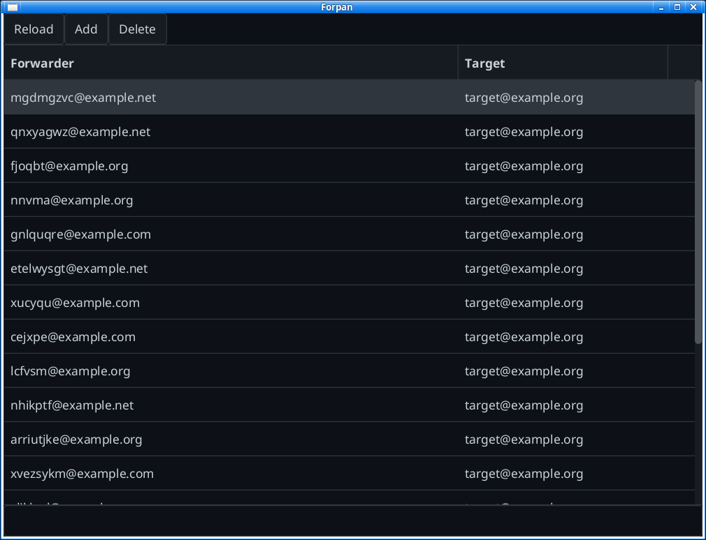
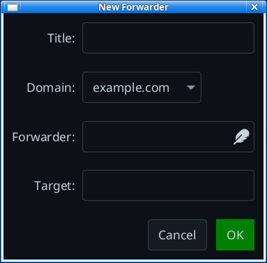
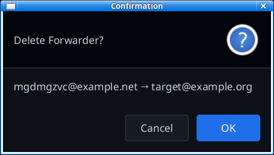

# ForPan - Manage cPanel Email Forwarders

## 1. Overview

[Email forwarders](https://en.wikipedia.org/wiki/Email_forwarding)
are a great way to curb spam by using them as [disposible email addresses](https://en.wikipedia.org/wiki/Disposable_email_address).

ForPan is a GUI app allowing to manage email forwarders hosted by a [cPanel service](https://docs.cpanel.net/cpanel/email/forwarders/).

The app is implemented in Java and JavaFX to run on the desktop of any OS for which the respective JRE is available.
It interacts with the API of the cPanel service to retrieve all forwarders, to add new forwarders, and to delete existing forwarders.

While a typical cPanel service installation has its a web-based UI to manage forwarders (among other things),
ForPan makes this more convenient for users who want to do this while sitting in front of their computer.  

## 2. Installation

Requirements
* JDK 21 (get an OpenJDK from [Adoptium](https://adoptium.net/))
* Maven 3.9.9 (from the [Apache Maven Project](https://maven.apache.org/download.cgi))

Make sure environment variables `JAVA_HOME` and `MAVEN_HOME` are set accordingly.

Build the project via the `build.sh` script. It's also meant to be called by a CI system.

## 3. Configuration

ForPan makes use of a [Java properties](https://en.wikipedia.org/wiki/.properties)
file  `~/.forpan/config.properties` for holding configuration values.

### cPanel API

If you want ForPan to talk to your cPanel service, define these properties:

```
cpanel.endpoint=
cpanel.user=
cpanel.pass=
```

... with

* `cpanel.endpoint` base URL of your cPanel service
* `cpanel.user` user ID to make calls
* `cpanel.pass` API token created with cPanel

### UI

To prepopulate a new forwarder with a date/time stamp, define a propery `forwarder.init.pattern=`
with a value following the syntax of [SimpleDateFormat](https://docs.oracle.com/javase/8/docs/api/java/text/SimpleDateFormat.html).

E.g. with `forwarder.init.pattern=yyMMDD` the forwarder field is initialized
with the current date.

## 4. Usage

Wrapper script `./run.sh` to run the built app.

> With environment variable `FORPAN_DUMMY_MODEL=true` ForPan uses a dummy data model 
> instead of talking to a real cPanel service.
> This also allows a quicker turnaround cycle for development.

### Main Screen

Shows all forwarders with their respective target address.



### Add Forwarder



### Add Forwarder


